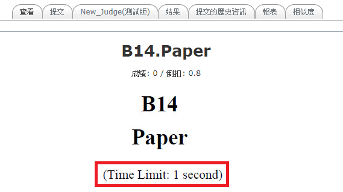
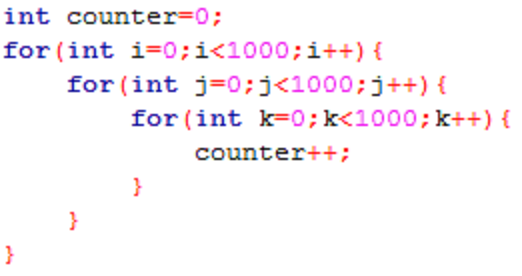
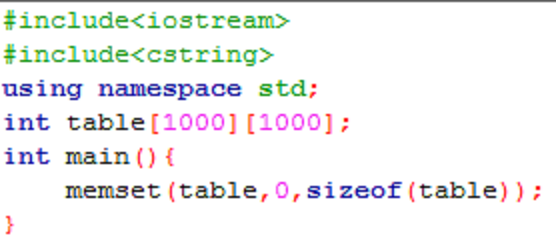

### 競程讀書會Week1
#### 打比賽的小細節&質數Prime

-----

### 打比賽的小細節

-----

#### 1. 這1秒到底是多久??


----

A: 跑10^9次指令 約等於 1秒



-----

#### 2. 題目要我開1000*1000的陣列

那我就開在main裡面

<div class="fragment">
	
</div>

----

A: 請開成全域變數，並搭配memset做初始化



-----

#### 3. 看到這些數字要小心

2^31

2147483647

10^11

----

A: 請全部開long long，不用省記憶體

-----

### 質數Prime

-----

### 質數的定義

一個數字除了1以及本身沒有其他因數

有些題目會把1也當成質數

-----

### 題目：給你n個數字(n<=100000)，每個數字大小為2~1000000007(約10^9)，請判斷哪些數字是質數

-----

#### 1. 直接判斷從2~n-1的整數有沒有n的因數
```
bool prime(int n){
	for(int i=2;i<n-1;i++){
		if(n%i==0){
			return false;
		}
	}
	return true;
}
```
<div class="fragment">
	慢，但最省記憶體
</div>

----

以題目來分析，若使用此方法

若題目給的100000個數字都是1000000007(此數是質數)

這樣大概會跑10^5 * 10^9 = 10^14，肯定吃TLE

-----

#### 2. 判斷從2~(根號n)+1的整數有沒有n的因數
```
bool prime(int n){
	for(int i=2;i<sqrt(n)+1;i++){
		if(n%i==0){
			return false;
		}
	}
	return true;
}
```
<div class="fragment">
	次慢，但也很省記憶體
</div>

----

#### 為甚麼判斷到(根號n)+1就可以了？

<div class="fragment">
	因數一定是由一大一小去配對的(也有可能相等)
</div>

<div class="fragment">
	舉例：36
</div>

----

以題目來分析，一樣設想最糟情況

大概會跑10^5 * sqrt(10^9)(約為31623) = 10^9以上，TLE

-----

#### 3. 建質數表_普通法

先預設陣列index 0為2

| index | 0 |
| ----- | - |
| value | 2 |

----

再來判斷數字3，陣列沒有3的因數，因此3是質數，加進陣列中

| index | 0 | 1 |
| ----- | - | - |
| value | 2 | 3 |

----

再來判斷數字4，因為陣列裡面2是4的因數(4%2==0)，所以4不是因數

| index | 0 | 1 |
| ----- | - | - |
| value | 2 | 3 |

----

再來判斷數字5，陣列沒有5的因數，因此5是質數，加進陣列中

| index | 0 | 1 | 2 |
| ----- | - | - | - |
| value | 2 | 3 | 5 |

----

以題目來分析

若從2~建表到sqrt(10^9)(約為31623)的話

實際測試大概會運算10^7次左右，可能會TLE，建議不要用

-----

#### 4.建質數表_篩法(sieve method)

使用一個bool陣列，用來儲存是不是質數的狀態
全部預設為true(除了0跟1)

| index | 0 | 1 | 2 | 3 | 4 | 5 | 6 | 7 | 8 | 9 | 10 |
| ----- | - | - | - | - | - | - | - | - | - | - | -  |
| value | 0 | 0 | 1 | 1 | 1 | 1 | 1 | 1 | 1 | 1 | 1  |

----

從2開始，因為值是true，因此將2的倍數全部改成false

| index | 0 | 1 | 2 | 3 | 4 | 5 | 6 | 7 | 8 | 9 | 10 |
| ----- | - | - | - | - | - | - | - | - | - | - | -  |
| value | 0 | 0 | 1 | 1 | 0 | 1 | 0 | 1 | 0 | 1 | 0  |

----

跑到3，因為值是true，因此將3的倍數全部改成false

| index | 0 | 1 | 2 | 3 | 4 | 5 | 6 | 7 | 8 | 9 | 10 |
| ----- | - | - | - | - | - | - | - | - | - | - | -  |
| value | 0 | 0 | 1 | 1 | 0 | 1 | 0 | 1 | 0 | 0 | 0  |

----

跑到4，因為值是false，不做任何事情

| index | 0 | 1 | 2 | 3 | 4 | 5 | 6 | 7 | 8 | 9 | 10 |
| ----- | - | - | - | - | - | - | - | - | - | - | -  |
| value | 0 | 0 | 1 | 1 | 0 | 1 | 0 | 1 | 0 | 0 | 0  |

----

跑到5，因為值是true，因此將5的倍數全部改成false

| index | 0 | 1 | 2 | 3 | 4 | 5 | 6 | 7 | 8 | 9 | 10 |
| ----- | - | - | - | - | - | - | - | - | - | - | -  |
| value | 0 | 0 | 1 | 1 | 0 | 1 | 0 | 1 | 0 | 0 | 0  |

----

以題目來分析

從2篩到sqrt(10^9)(約為31623)，大約會運算10^5次，非常快

時間複雜度為O(NlogN)

缺點是範圍有限，太大的話陣列會開到爆

-----

題目練習-闖關題UVA583、進階題UVA294
